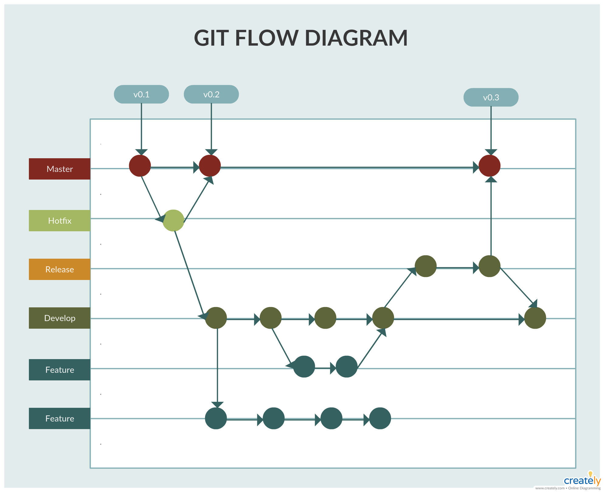

# Git_theory
Git_theory

## What is version Control

Version control is the practice of tracking and managing versions of code. This can be used to change sourcecode 
over time . Version control is important for DevOps as they help increase successful deployments by keeping track of
modifications and reverting changes when the code fails. Version control protects the source code from changes that
have not been properly tested or that prove to disrupt the program, it also allows developers to be working in parralel
by organisation in a file tree that can be changed and later implemented.

## What is Git

The most widely used version control system. Git is a distributed version control system, every developer can keep their own 
repository that can be later merged.

## Diagram of Git

## Why is Git used and Benefits of Git

Git has numerous benefits such as the ability to work in parralel and then integrate or abandon changes at a later date. Git is not affected by file names in the same way some other systems are , which avoids errors and keeps files secure. It is also a fast program since it is written in C and has excellent compatibility with different operating systems.

## Why do we use Git in Devops

Many of the advantages of Devops rely on the benefits of git such as faster release time and working in parallel on different modules.

## What is Github, distinction between Git and GitHub

GitHub is a web based git repository hosting service which offers the functionality of git as well as online features. Git is the distributed version control system itself.

## The link between Git and Github